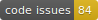

# Brain Observatory Toolbox

[](https://github.com/ehennestad/bot-demo/releases/latest)
[](https://se.mathworks.com/matlabcentral/fileexchange/90900-brain-observatory-toolbox)
[](https://github.com/ehennestad/bot-demo/actions/workflows/test-code.yml)
[](https://codecov.io/gh/ehennestad/bot-demo)
[](https://github.com/ehennestad/bot-demo/security/code-scanning)
[](https://github.com/ehennestad/bot-demo/actions/workflows/run-codespell.yml)
[](https://gitHub.com/ehennestad/bot-demo/graphs/commit-activity)

A MATLAB toolbox for interacting with the Allen Brain Observatory

## Description

A MATLAB toolbox for accessing and using the neural recording public datasets from the Allen Brain Observatory

## Requirements and installation
It is recommended to use **MATLAB R2019b** or later.
The following MathWorks products are required:
- MATLAB
The toolbox can be installed from MATLAB's [Add-On Explorer](https://se.mathworks.com/help/matlab/matlab_env/get-add-ons.html) (recommended). It is also possible to download the MATLAB toolbox from [FileExchange](https://se.mathworks.com/matlabcentral/fileexchange/90900-brain-observatory-toolbox) or from the [Releases](https://github.com/ehennestad/bot-demo/releases/latest) page of this repository and install it manually.

Users or developers who clone the repository using git can use [MatBox](https://github.com/ehennestad/MatBox) to quickly install this project's [requirements](./requirements.txt) (if any):

```matlab
bottools.installMatBox() % If MatBox is not installed
matbox.installRequirements(path/to/toolboxRootDir)
```

## Getting started

```matlab
< add some code examples here >
```

## Contributing
Please see the [Contributing guidelines](.github/CONTRIBUTING.md) and the [Developer notes](.github/DeveloperNotes.md)

## License

This project is available under the BSD-2-Clause License. See the LICENSE file for details.

## Author

John Doe (johndoe@example.com)
John Doe Inc.
